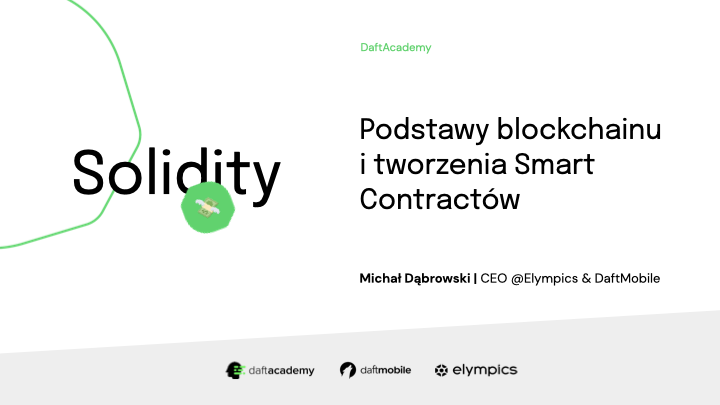

[](https://github.com/DaftAcademy-Solidity-2022/Home)


[](https://daftacademygroup.slack.com/)

---

## Wyniki prac domowych

Wyniki prac domowych są dostępne [tutaj](https://docs.google.com/spreadsheets/d/1JvAarcIiFJXOwx7QpKz51ucZbidmAfmTYukBoOpIy60/edit#gid=0)!

Aby poznać swój wynik, trzeba zahashować swój github username (sha256). Aby to zrobić, można użyć [tej strony](https://emn178.github.io/online-tools/sha256.html), lub można to zrobić z linii komend:

```sh
echo -n "mdab121" | openssl dgst -sha256
```

## Zajęcia

### Zajęcia 1: Podstawy blockchainu i smart contractów

#### Zalety blockchainu i smart contractów

- Decentralizacja
- Transparentność i pseudo-anonimowość
- Bezpieczeństwo (protokołu)
- Usunięcie konfliktu interesów
- Ograniczenie zaufania (nie-łamalne obietnice)

#### Zasady działania blockchainu

Zasady działania (matematyczne i kryptograficzne) są najlepiej wyjaśnione tutaj:

- [Blockchain demo](https://andersbrownworth.com/blockchain/)
- [Public/Private keys demo](https://andersbrownworth.com/blockchain/public-private-keys/)

#### Solidity

Solidty jest ewoluującym językiem, zmieniającym się bardzo często. Obecnie aktualna wersja (w momencie pisania tego tekstu) to wersja `0.8.17`. Za każdym razem przy zmianach w minor wersji (druga cyfra) są wprowadzane breaking chages. W trakcie kursu będziemy korzystać z wersji Solidity `0.8.7`. Tym niemniej zmiany pomiędzy kolejnymi patchami (ostatnia liczba) nie będą duże i nie wpłyną na przebieg kursu.

##### Składnia

```solidity
// Deklaracja wersji Solidity
pragma solidity 0.8.7;

// Deklaracja zmiennej
uint256 number = 42;
int number2 = -10;
uint8 smallNumber = 25;
uint bigNumber = 10e18;
uint256 unknownNumber;
bool isCool = true;
address caller = address(0x1E7B5D5166142853EF9e02E983465A5d058d4c6d);

// Tablice
uint256[5] fixedSizeArray;
uint256[] dynamicSizedArray;

fixedSizeArray[0] = 10;
uint256 x = fixedSizeArray[4];
uint256 y = fixedSizeArray[0] + fixedSizeArray[1];

dynamiSizedArray.push(10);
uint256 z = dynamicSizedArray[0];
dynamiSizedArray.pop();

// Mapping
mapping(address => uint256) public balances;

address someAddress = address(0x1E7B5D5166142853EF9e02E983465A5d058d4c6d);
uint256 value = balances[someAddress];
balances[someAddress] = 30;

// Funkcje

function double(uint256 value) public pure returns(uint256) {
  return value * 2;
}

// Kontrakt

contract HelloWorld {
  
  // variables

  // functions

}
```

#### Przykładowy kontrakt

```solidity
// SPDX-License-Identifier: MIT

pragma solidity 0.8.7;

contract Storage {

    uint256 public number;

    function store(uint256 value) public {
        number = value;
    }

}
```

Kontrakt został zdeployowany na Goerli Testnet Network pod adresem [0xB93df37D64dE47a5fB7DC1f9784Ec2d968Ebc33f](https://goerli.etherscan.io/address/0xb93df37d64de47a5fb7dc1f9784ec2d968ebc33f). Jest dostępny na Etherscan i zweryfikowany, to znaczy że jego ABI jest znane i możemy wywoływać metody z tego smart contractu bezpośrednio z EtherScan (spróbujcie).


---

## Materiały

- [Dokumentacja Solidity](https://docs.soliditylang.org/en/v0.8.7/introduction-to-smart-contracts.html)
- [Ethereum Converter](https://eth-converter.com/)
- [Remix IDE](https://remix.ethereum.org/)
- [Hardhat](https://hardhat.org/)

## Kontakt

- [Slack](https://daftacademygroup.slack.com/)
